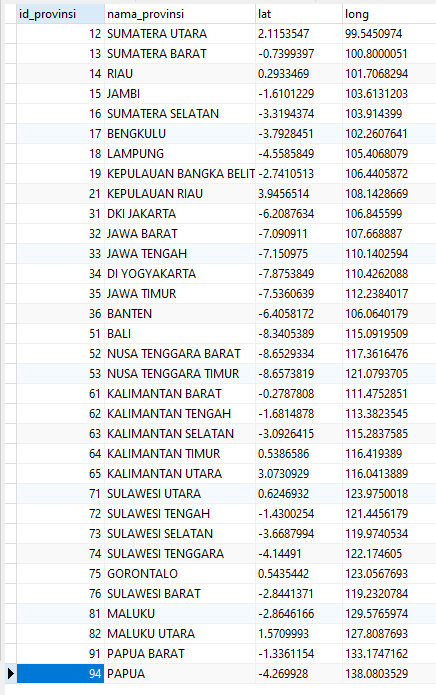

# Database Wilayah Indonesia

database ini berisikan didalamnya :

- [x] tabel provinsi
- [x] tabel kota
- [x] tabel kecamatan
- [x] sudah termasuk longitude latitude 

# Cara menggunakan
1. Buat database dengan nama **wilayah_indonesia**
2. Setelah itu kalian import database dari repo ini
3. Tunggu beberapa saaat
4. Selesai
5. Tinggal di gunakan sesuai kebutuhan

# Screenshoot
**PREVIEW TABEL PROVINSI** :  

*jika ada cuaca yang cerah*  
  
